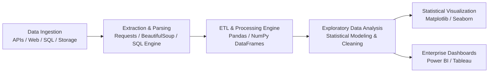

<div align="center">

# Production-Grade Data Science & Analytical Engineering

### Enterprise Data Pipelines • Exploratory Data Analysis • Statistical Modeling • BI Analytics Architecture


</div>

---

## Executive Summary

This repository contains a comprehensive **Data Engineering, Statistical Modeling, and Business Intelligence (BI) Analytics Architecture** designed to conform with Big Tech / FAANG industry standards. The codebase bridges low-level numerical computation with scalable analytical pipeline automation, featuring structured implementations across **NumPy**, **Pandas**, **Matplotlib**, **Seaborn**, **SQL Server Engine**, **Power BI**, **Tableau**, and automated **ETL Data Scraping & API Pipelines**.

---

## 🛠 Tech Stack & Analytical Engineering Capabilities

| Technology | Architectural Scope | Primary Engineering Applications |
| :--- | :--- | :--- |
| **[NumPy](file:///Users/ronitmexson/Downloads/Coding/Youtube/git-demo/Data%20Analysis/Data-Analysis/Numpy)** | Numerical Kernels & Vectorization | C-accelerated array operations, multi-dimensional matrix linear algebra, vectorization, & tensor manipulation. |
| **Pandas** | High-Throughput Tabular Engine | Memory-efficient DataFrame transformations, multi-key aggregations, time-series analysis, & join algorithms. |
| **Matplotlib** | Low-Level Rendering Canvas | Low-level plotting engine, granular pixel/axes layout control, static & dynamic multi-panel visual figures. |
| **Seaborn** | Statistical Inference Visualizer | Statistical distribution modeling, heatmaps, pair plots, & multi-variate regression visualizations. |

---

## 📐 Data Pipeline & Analytics Workflow



---

## 🎯 Repository Architecture

```text
Data-Analysis/
├── Numpy/             # High-performance matrix computations, tensor ops, vectorization benchmarks
├── Pandas/            # Production data wrangling pipelines, memory optimization, complex joins & indexing
├── Matplotlib/        # Low-level figure canvas, multi-panel layouts, customized data visualizations
├── Seaborn/           # Statistical distribution analysis, heatmaps, multi-variate regression plots
├── SQL/               # Relational schema optimization, window functions, CTEs, stored procedures, ETL data cleaning
├── Excel/             # Financial modeling, XLOOKUP engine, multi-variable scenario modeling & dynamic charts
├── Tableau/           # Enterprise visual analytics, LOD expressions, calculated fields, dashboard architecture
├── PowerBI/           # Star-schema data modeling, DAX measure optimization, Power Query M-code transformations
├── Projects/          # End-to-end production scripts (Crypto API ETL, Automated Scraping, Web Automation)
└── README.md          # Production-grade technical documentation & modular curriculum index
```

---

## 📚 Technical Index & Curriculum Engineering Roadmap

A structured breakdown of all 58 computational modules, query optimization techniques, statistical workflows, and portfolio projects.

---

### 1. Relational Database Systems & Query Optimization (SQL)

*Focus: Schema design, transaction safety, query execution plans, window aggregations, and production ETL cleaning.*

<details open>
<summary><b>View SQL Modules</b></summary>

| Module ID | Timestamp | Technical Topic | Engineering Depth & Implementation Focus |
| :---: | :---: | :--- | :--- |
| `SQL-101` | `00:00:00` | Systems Introduction | Environment setup & relational architecture overview |
| `SQL-102` | `00:01:10` | Industry Roadmap | Analytics Engineering competency matrix & skill set |
| `SQL-103` | `00:15:08` | RDBMS Engine | SSMS deployment, DDL schema design, constraints, table initialization |
| `SQL-104` | `00:24:44` | Data Retrieval | Projections & logical execution sequence of `SELECT` + `FROM` |
| `SQL-105` | `00:30:57` | Predicate Filtering | Boolean evaluation & index usage in `WHERE` filtering |
| `SQL-106` | `00:38:54` | Analytical Aggregations | `GROUP BY` execution strategies & `ORDER BY` sorting algorithms |
| `SQL-201` | `00:47:03` | Relational Joins | Hash join, nested loop, merge join evaluation (`INNER`/`OUTER`) |
| `SQL-202` | `01:02:55` | Set Theory Operations | `UNION` vs `UNION ALL` execution plan analysis & deduplication |
| `SQL-203` | `01:08:19` | Conditional Projections | Search vs Simple `CASE` evaluation in high-cardinality queries |
| `SQL-204` | `01:15:44` | Post-Aggregation Filtering | `HAVING` clause execution order relative to aggregation nodes |
| `SQL-205` | `01:19:15` | DML Operations | ACID compliance in `UPDATE`/`DELETE` operations & table locking |
| `SQL-206` | `01:23:51` | Namespace Aliasing | Query readability & self-join entity distinction |
| `SQL-207` | `01:30:02` | Window Partitioning | `PARTITION BY` vs `GROUP BY`, sliding frame specs, analytical functions |
| `SQL-301` | `01:34:16` | Subquery Factorization | Common Table Expressions (CTEs) & recursive evaluation |
| `SQL-302` | `01:37:59` | Volatile Storage | `#TempTables` vs `@TableVariables`, stats generation & tempdb I/O |
| `SQL-303` | `01:48:18` | String Functions | Operations (`SUBSTRING`, `REPLACE`, `TRIM`, `CHARINDEX`) |
| `SQL-304` | `01:02:06` | Procedural Logic | Stored procedure compilation, execution plan caching & parameters |
| `SQL-305` | `02:08:20` | Nested Queries | Correlated vs non-correlated subqueries (scalar & table-valued) |
| `SQL-PROJ1`| `02:16:57` | **Production Portfolio Project** | High-dimensional exploratory data analysis via SQL Engine |
| `SQL-PROJ2`| `03:34:01` | **Production Portfolio Project** | Enterprise ETL data cleaning, standardization & anomaly detection |

</details>

---

### 2. Operational Analytics & Financial Modeling (Excel Engine)

*Focus: Financial modeling, dynamic lookup engines, advanced data sanitization, and operational dashboards.*

<details>
<summary><b>View Excel Modules</b></summary>

| Module ID | Timestamp | Technical Topic | Implementation Focus |
| :---: | :---: | :--- | :--- |
| `XLC-101` | `04:28:41` | Multidimensional Aggregations | Pivot tables, calculated fields, dynamic grouping |
| `XLC-102` | `04:46:15` | Vectorized Formulas | Logical, statistical, & array formulas |
| `XLC-103` | `05:20:07` | Dynamic Lookup Engines | `XLOOKUP` double-lookup, exact match, wildcards & matrix lookups |
| `XLC-104` | `05:38:52` | Rule-Based Formatting | Data visualization highlighting & conditional rules |
| `XLC-105` | `05:59:49` | Data Visual Analytics | Combo charts, secondary axes, distribution plots |
| `XLC-106` | `06:14:58` | Data Wrangling | Text-to-columns, deduplication, handling missing values |
| `XLC-PROJ` | `06:36:02` | **Operational Project** | End-to-end financial & operational dashboard model |

</details>

---

### 3. Business Intelligence Architecture (Tableau & Power BI)

*Focus: Semantic data modeling (Star Schema), DAX measure optimization, Power Query M-code, and executive dashboards.*

<details>
<summary><b>View BI Analytics Modules</b></summary>

#### 🟦 Tableau BI Architecture
| Module ID | Timestamp | Topic | Technical Focus |
| :---: | :---: | :--- | :--- |
| `TAB-101` | `07:16:49` | Environment Architecture | Tableau Desktop workflow, extract vs live connections |
| `TAB-102` | `07:33:53` | Analytics & Binning | Fixed/Include/Exclude LODs, calculated fields & bins |
| `TAB-103` | `07:40:17` | Visual Component Design | Parameter-driven visuals, action filters, dual-axis charts |
| `TAB-104` | `07:54:20` | Data Relationships | Physical vs logical data model joins & blending |
| `TAB-PROJ` | `08:08:47` | **Enterprise BI Project** | End-to-end interactive executive dashboard |

#### 🟡 Microsoft Power BI Architecture
| Module ID | Timestamp | Topic | Technical Focus |
| :---: | :---: | :--- | :--- |
| `PBI-101` | `08:53:02` | Platform Architecture | Power BI Service & Desktop integration |
| `PBI-102` | `09:05:51` | ETL & M-Code | Power Query transformation, query folding, schema modeling |
| `PBI-103` | `09:18:57` | Dimensional Modeling | Star schema design, active/inactive relationship management |
| `PBI-104` | `09:27:33` | DAX Engine | Filter context, evaluation context, `CALCULATE`, time intelligence |
| `PBI-105` | `09:43:16` | Hierarchical Navigation | Drill-through actions, drill-down parameters, custom tooltips |
| `PBI-106` | `09:49:18` | Visual Analytics | Dynamic conditional formatting using DAX measures |
| `PBI-107` | `09:59:10` | Data Discretization | Static vs dynamic bins, list parameters |
| `PBI-108` | `10:08:40` | Visual UX Design | Custom visual selection, performance optimization |
| `PBI-PROJ` | `10:22:54` | **Enterprise BI Project** | Complete end-to-end Power BI analytical suite |

</details>

---

### 4. Core Python Software Engineering & Automated Data Ingestion

*Focus: Object-oriented Python, memory efficiency, REST API consumption, and HTML DOM parsing.*

<details>
<summary><b>View Python & Scraping Modules</b></summary>

| Module ID | Timestamp | Technical Topic | Implementation & CS Fundamentals Focus |
| :---: | :---: | :--- | :--- |
| `PY-101` | `11:05:31` | Runtime Environment | Anaconda environment management, kernel config, Jupyter setup |
| `PY-102` | `11:15:34` | Memory Allocation | Variable reference bindings, dynamic typing, scoping |
| `PY-103` | `11:28:51` | Primitive & Collections | Mutability, performance characteristics of `dict`, `list`, `set`, `tuple` |
| `PY-104` | `11:50:48` | Evaluation Operators | Short-circuit logic, bitwise vs logical evaluation |
| `PY-105` | `11:58:03` | Control Structure | Conditional branching optimization & execution flow |
| `PY-106` | `12:04:42` | Iterative Algorithms | `for` loop state tracking, iterators, list comprehensions |
| `PY-107` | `12:13:59` | State Machine Loops | `while` loop conditions, termination criteria, error guards |
| `PY-108` | `12:19:39` | Modular Functions | First-class functions, `*args`, `**kwargs`, scope resolution |
| `PY-109` | `12:32:22` | Type Conversion | Type casting protocols & exception-safe conversion |
| `PY-PROJ1`| `12:38:57` | **Automation Script** | Algorithmic metrics engine |
| `PY-PROJ2`| `12:53:19` | **Automation Script** | Automated File Explorer OS file system organization engine |
| `SCR-101` | `13:10:10` | Web Architecture | HTML DOM structure, CSS selector syntax, HTTP request lifecycle |
| `SCR-102` | `13:16:03` | Scraping Libraries | `requests` session handling, header spoofing, `BeautifulSoup` parsing |
| `SCR-103` | `13:23:01` | DOM Extraction | Navigation trees via `find()` & `find_all()`, regex pattern matching |
| `SCR-104` | `13:35:11` | Production Scraping | Rate limiting, error handling, robust retry mechanisms |

</details>

---

### 5. High-Performance Data Transformation & EDA (Pandas & NumPy)

*Focus: Vectorized array computation, DataFrame memory optimization, multi-key joins, and Exploratory Data Analysis.*

<details open>
<summary><b>View Pandas & EDA Modules</b></summary>

| Module ID | Timestamp | Technical Topic | Engineering & Statistical Focus |
| :---: | :---: | :--- | :--- |
| `PD-101` | `14:00:33` | I/O Systems | High-throughput data ingestion (CSV, Parquet, JSON, SQL) |
| `PD-102` | `14:19:49` | Slicing & Selection | `.loc[]`, `.iloc[]`, boolean indexing, query performance |
| `PD-103` | `14:31:37` | Index Architecture | MultiIndex (hierarchical indexing), alignment, reindexing |
| `PD-104` | `14:42:59` | GroupBy Engine | Split-Apply-Combine methodology, custom aggregation functions |
| `PD-105` | `14:54:04` | Merge & Relational Ops | Inner/Left/Right/Outer joins, memory footprint of merges |
| `PD-106` | `15:16:13` | Integrated Plotting | Pandas wrapper methods around Matplotlib visualization engine |
| `PD-107` | `15:33:02` | Data Sanitization | Handling missing data (`NaN`/`NaT`), deduplication, type optimization |
| `PD-108` | `16:11:39` | **Exploratory Data Analysis** | Comprehensive statistical EDA workflow, outlier detection, correlations |

</details>

---

### 6. Production Data Pipelines & FAANG Career Engineering

*Focus: Real-time API ETL pipelines, web scraping systems, and industry technical portfolio presentation.*

<details>
<summary><b>View Pipeline & Career Modules</b></summary>

| Module ID | Timestamp | Project / Career Topic | Industry Application |
| :---: | :---: | :--- | :--- |
| `SYS-PROJ1`| `16:43:52` | **E-Commerce Web Scraper** | Robust production scraper with rate-limiting & data serialization |
| `SYS-PROJ2`| `17:31:03` | **Crypto API Automated Pipeline** | Automated API ingestion pipeline with error logging & storage |
| `CAR-101`  | `18:22:13` | Portfolio Web Architecture | Building high-impact engineer portfolio sites |
| `CAR-102`  | `18:57:39` | Technical Resume Design | Quantified bullet points (X-Y-Z framework) for FAANG screening |
| `CAR-103`  | `19:15:16` | Strategic Networking | Tech recruitment positioning & LinkedIn optimization |
| `CAR-104`  | `19:22:05` | Industry Credentials | Verification & domain certification strategy |

</details>

---

## ⚡ Environment Setup & Deployment

### Prerequisites
- **Python Runtime**: `Python >= 3.9`
- **Package Management**: `pip` or `conda`

### Local Development Environment Setup

```bash
# 1. Clone repository
git clone https://github.com/your-username/Data-Analysis.git
cd Data-Analysis

# 2. Create isolated virtual environment
python3 -m venv venv
source venv/bin/activate  # On Windows: venv\Scripts\activate

# 3. Upgrade core packaging infrastructure
pip install --upgrade pip setuptools wheel

# 4. Install production dependencies
pip install numpy pandas matplotlib seaborn beautifulsoup4 requests jupyterlab

# 5. Start JupyterLab development environment
jupyter lab
```

---

## 🏛 Engineering Principles & Optimization

- **Vectorized Execution**: Avoid explicit Python loops in data transformation steps; leverage C-accelerated NumPy and Pandas vector operations.
- **Memory Footprint Management**: Downcast numeric types (`float64` $\rightarrow$ `float32`, `int64` $\rightarrow$ `int32`) and convert low-cardinality strings into `category` data types.
- **Decoupled Pipeline Design**: Separate data extraction (Scraping/API), data transformation (Pandas/SQL), and data presentation (Seaborn/Power BI).
- **Reproducible Analytics**: Deterministic random state seeding, parameterized inputs, and version-pinned environments.

---

## 📄 License

This repository is licensed under the **MIT License**. See `LICENSE` for details.
