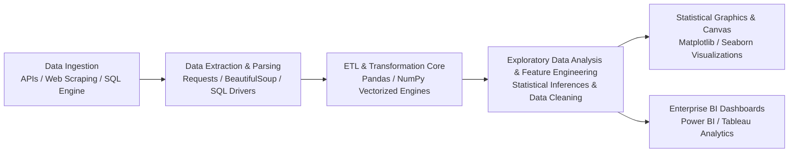

<div align="center">

# Production-Grade Data Science & Analytical Engineering

### Enterprise Data Pipelines • Exploratory Data Analysis • Statistical Modeling • BI Analytics Architecture


</div>

---

## Executive Summary

This repository serves as a production-grade showcase of **Data Engineering, High-Performance Numerical Computing, Exploratory Data Analysis (EDA), Statistical Modeling, and Business Intelligence (BI)**. Built to align with FAANG / Big Tech engineering standards, this repository documents technical implementation, modular scripts, Jupyter notebooks, and end-to-end portfolio projects covering **NumPy**, **Pandas**, **Matplotlib**, **Seaborn**, **SQL Query Optimization**, **Power BI**, **Tableau**, **Web Scraping**, and **Automated ETL API Pipelines**.

---

## 🛠 Core Engineering Stack & Capabilities

| Core Technology | Architectural Role | Technical Mastery & Engineering Competencies |
| :--- | :--- | :--- |
| **[NumPy](file:///Users/ronitmexson/Downloads/Coding/Youtube/git-demo/Data%20Analysis/Data-Analysis/Numpy)** | Vectorized Array Kernel | Multi-dimensional tensor ops, memory-aligned broadcasting, C-accelerated linear algebra, indexing & slicing optimization. |
| **Pandas** | High-Throughput Tabular Engine | Memory-optimized DataFrames, multi-key join algorithms, split-apply-combine aggregation, feature extraction pipelines, capstones. |
| **Matplotlib** | Rendering Canvas Engine | Low-level figure & subplots canvas architecture, custom axis manipulation, distribution/matrix plots, Plotly integration, IPL analytics. |
| **Seaborn** | Statistical Inference Graphics | Multi-variate KDE density plots, pair grids, swarm/violin distribution analysis, correlation heatmaps, regression modeling. |
| **SQL Engine** | Enterprise Database Systems | Relational schema design, CTE query factorization, window functions (`PARTITION BY`), tempdb volatile storage, stored procedures. |
| **Power BI / Tableau** | BI Analytics & Data Modeling | Star schema modeling, DAX time-intelligence measure design, Power Query M-code, LOD expressions (`FIXED`/`INCLUDE`), dashboards. |

---

## 📐 End-to-End Data Pipeline Architecture



---

## 🎯 Repository Directory Structure

```text
Data-Analysis/
├── Numpy/             # High-performance tensor ops, memory alignment, linear algebra & array benchmarks
├── Pandas/            # Production data wrangling, missing data imputation, feature extraction & capstone projects
├── Matplotlib/        # Low-level canvas architecture, categorical/matrix plots & sports analytics capstone
├── Seaborn/           # Statistical inference visualizations, pair grids, distribution modeling & heatmaps
├── SQL/               # Relational query optimization, CTEs, window partitioning, temp tables & ETL data cleaning
├── Excel/             # Financial & operational modeling, dynamic XLOOKUP engines & dynamic dashboards
├── Tableau/           # Enterprise BI analytics, LOD calculations, calculated fields & interactive dashboards
├── PowerBI/           # Star-schema dimensional modeling, DAX measures, M-code Power Query transformations
├── Projects/          # Automated ETL pipelines (Amazon Web Scraper, Crypto API Pull, BMI Engine, File Sorter)
└── README.md          # Production-grade technical documentation & skill competency portfolio
```

---

## 📚 Technical Competencies & Knowledge Index

Below is the comprehensive technical breakdown of the skills, algorithm implementations, statistical concepts, and data engineering projects mastered within this repository.

---

### 1. NumPy – High-Performance Vectorized Computing

*Focus: Multi-dimensional array structures, memory-aligned broadcasting, C-accelerated numeric operations, and linear algebra.*

| Module Code | Core Concept / Topic Mastered | Technical Implementation & Engineering Details |
| :---: | :--- | :--- |
| `NUM-101` | Environment & Architecture | Notebook setup, NumPy engine architecture, contiguous C-memory alignment |
| `NUM-102` | Array Data Structures | 1D vectors, 2D matrices, N-dimensional arrays (`ndarray`), dtype selection |
| `NUM-103` | Indexing & Array Slicing | Basic slicing, multi-axis indexing, boolean masking, fancy indexing |
| `NUM-104` | Vectorized Array Operations | Element-wise arithmetic, matrix dot products, broadcasting rules, universal functions (`ufuncs`) |
| `NUM-105` | Numerical Aggregations | Fast axis-wise reductions (`sum`, `mean`, `std`, `var`, `min`, `max`, `argmin`, `argmax`) |
| `NUM-106` | Applied Benchmarks | Hands-on computational exercises, matrix transformation algorithms, performance testing |

---

### 2. Pandas – High-Throughput Data Wrangling & Feature Engineering

*Focus: Tabular data wrangling, missing value imputation, multi-key joins, split-apply-combine aggregations, and real-world capstone projects.*

| Module Code | Core Concept / Topic Mastered | Technical Implementation & Engineering Details |
| :---: | :--- | :--- |
| `PD-101` | Pandas Series | 1D labeled data structures, index alignment, vector operations |
| `PD-102` | DataFrame Manipulation | 2D tabular data structures, column selection, row filtering (`loc`/`iloc`), dynamic mutations |
| `PD-103` | Missing Data Imputation | Identifying `NaN`/`NaT` values, forward/backward fill strategies, mean/median/custom imputation |
| `PD-104` | Relational Transformations | Multi-table joins (`merge`), vertical/horizontal concatenation (`concat`), key alignment |
| `PD-105` | GroupBy & Aggregations | Split-Apply-Combine methodology, custom lambda aggregations, multi-level indexing |
| `PD-106` | Pivot Tables & Cross-Tabs | High-dimensional data reshaping, contingency tables, dynamic aggregation matrices |
| `PD-107` | DataFrame Vector Operations | Element-wise `.apply()`, mapping dictionaries (`.map()`), sorting algorithms, value counts |
| `PD-108` | Advanced Querying & Filtering | Complex multi-condition indexing, string queries, regular expressions in Pandas |
| `PD-PROJ1`| **Feature Extraction Pipeline** | Automated feature engineering, scaling, categorical encoding, and transformation pipelines |
| `PD-PROJ2`| **Data Analytics Capstone** | End-to-end real-world exploratory data analysis, data cleaning, and statistical synthesis |

---

### 3. Matplotlib – Low-Level Rendering Canvas & Sports Analytics

*Focus: Canvas rendering architecture, figure/axes layout management, statistical distribution plots, Plotly integration, and sports analytics projects.*

| Module Code | Core Concept / Topic Mastered | Technical Implementation & Engineering Details |
| :---: | :--- | :--- |
| `MPL-101` | Visualization Fundamentals | Understanding graphic communication, chart selection, publication-ready visual guidelines |
| `MPL-102` | Matplotlib Canvas Architecture | Object-oriented `Figure` and `Axes` interface, subplots grid configuration, figure sizing |
| `MPL-103` | Distribution Visualizations | Histograms, Kernel Density Estimates (KDE), frequency polygon plots |
| `MPL-104` | Categorical Plotting | Bar charts, horizontal bar charts, count plots, customized box plots |
| `MPL-105` | Matrix Visualizations | Heatmap grid displays, 2D color intensity matrices, correlation plots |
| `MPL-106` | Regression Plots | Scatter plot trendlines, confidence interval shading, residual visual diagnostics |
| `MPL-107` | Interactive Graphics | Integration with `Plotly` and `Cufflinks` for interactive web-rendered figures |
| `MPL-PROJ` | **IPL Sports Analytics Project** | Comprehensive sports analytics capstone project analyzing match trends & player statistics |

---

### 4. Seaborn – Statistical Inference & Multi-Variate Visual Analytics

*Focus: Advanced statistical plot types, multi-variate density estimation, pair grids, custom aesthetic palettes, and categorical distributions.*

| Module Code | Core Concept / Topic Mastered | Technical Implementation & Engineering Details |
| :---: | :--- | :--- |
| `SEA-101` | Environment & Dataset Loading | Seaborn setup, importing built-in datasets (Tips, Titanic, Iris, Car Crashes) |
| `SEA-102` | Bi-Variate Scatter Plots | Relationship modeling between numeric variables with categorical hue mapping |
| `SEA-103` | Aesthetics & Styling | Theme configurations (`darkgrid`, `whitegrid`, `ticks`), context scaling (`paper`, `talk`) |
| `SEA-104` | Custom Palette Engineering | Qualitative, sequential, and diverging color palettes for data representation |
| `SEA-105` | Categorical Point Distributions | `stripplot` (jitter points) vs `swarmplot` (non-overlapping point distributions) |
| `SEA-106` | Distribution & Frequency | Histograms, KDE density estimations, marginal `rugplot` distributions |
| `SEA-107` | Linear Modeling Plots | `regplot` and `lmplot` linear regression visual representations |
| `SEA-108` | Time-Series Line Visuals | Continuous line plots with automatic error band estimations |
| `SEA-109` | Bi-Variate Marginal Visuals | `jointplot` combining scatter/KDE plots with marginal univariate histograms |
| `SEA-110` | Categorical Estimations | `barplot` (mean estimation with confidence intervals) and `countplot` |
| `SEA-111` | Interquartile Distribution | `boxplot` (IQR & outlier detection) and `violinplot` (distribution density curves) |
| `SEA-112` | Matrix & Grid Visuals | Correlation `heatmap` matrices, `pairplot` bi-variate matrices, `PairGrid` customization |

---

### 5. Enterprise Relational Database Engineering (SQL)

*Focus: Database schema design, transaction safety, query execution optimization, CTEs, window functions, and production ETL cleaning.*

| Module Code | Core Concept / Topic Mastered | Technical Implementation & Engineering Details |
| :---: | :--- | :--- |
| `SQL-101` | Database Engine Architecture | SSMS installation, DDL schema design, primary/foreign key constraints |
| `SQL-102` | Core Query Projection | Execution lifecycle of `SELECT`, `FROM`, `WHERE` filtering logic |
| `SQL-103` | Aggregations & Grouping | `GROUP BY` execution strategies, `HAVING` post-aggregation filters, `ORDER BY` sorting |
| `SQL-104` | Relational Join Optimization | Physical join algorithms (`INNER`, `LEFT`, `RIGHT`, `FULL OUTER` joins) |
| `SQL-105` | Set Theory & Deduplication | `UNION` vs `UNION ALL` execution plans and memory allocation |
| `SQL-106` | Advanced Logic & Windows | Search `CASE` statements, `PARTITION BY` window functions, row ranking |
| `SQL-107` | Subquery Factorization | Common Table Expressions (CTEs), recursive queries, temp tables (`#TempTables`) |
| `SQL-108` | Advanced Database Objects | String manipulation functions, stored procedure parameterization, subqueries |
| `SQL-PROJ1`| **SQL Data Exploration** | Complex multi-table exploratory querying on high-dimensional datasets |
| `SQL-PROJ2`| **SQL Data Cleaning** | Production ETL data cleaning, null handling, duplicate removal, standardization |

---

### 6. Microsoft Excel Operational & Financial Analytics

*Focus: Financial modeling, dynamic lookup engines, advanced data sanitization, and operational dashboards.*

| Module Code | Core Concept / Topic Mastered | Technical Implementation & Engineering Details |
| :---: | :--- | :--- |
| `XLC-101` | Dynamic Aggregations | Pivot tables, custom calculated fields, dynamic item grouping |
| `XLC-102` | Formula Vectorization | Complex nested logical, mathematical, and statistical formulas |
| `XLC-103` | Advanced Lookup Engines | `XLOOKUP` exact matches, wildcards, horizontal/vertical matrix lookups |
| `XLC-104` | Conditional Formatting | Data visual highlighting rules, gradient heatmaps, icon sets |
| `XLC-105` | Visual Analytics & Cleaning | Custom combo charts, dual-axis graphs, text-to-columns, data deduplication |
| `XLC-PROJ` | **Operational Dashboard** | Fully dynamic, interactive operational and financial dashboard model |

---

### 7. Business Intelligence & Data Modeling (Tableau & Power BI)

*Focus: Star-schema data modeling, DAX time-intelligence formulas, Power Query M-code, LOD expressions, and executive dashboards.*

#### 🟦 Tableau BI Architecture
- **Data Connections**: Live vs. Extract connectivity options.
- **Level of Detail (LOD)**: `FIXED`, `INCLUDE`, `EXCLUDE` calculations.
- **Advanced Visuals**: Parameter controls, action filters, dual-axis visual maps.
- **Capstone Project**: Interactive enterprise executive dashboard.

#### 🟡 Microsoft Power BI Architecture
- **ETL Transformation**: Power Query M-code transformations & query folding.
- **Data Modeling**: Star schema, dimensional table relationships, active/inactive cardinalities.
- **DAX Engine**: `CALCULATE`, filter context modification, time intelligence (`SAMEPERIODLASTYEAR`, `YTD`).
- **Visual Features**: Drill-through pages, custom tooltips, dynamic conditional formatting measures.
- **Capstone Project**: Full end-to-end business intelligence analytical suite.

---

### 8. Python Engineering, Web Scraping & Automated Pipelines

*Focus: Object-oriented Python fundamentals, REST API automated ingestion, DOM parsing, and operating system file automation.*

- **Python Core**: Data structures (`list`, `dict`, `set`, `tuple`), control flow, functions, exception handling.
- **Automation Scripts**:
  - *BMI Metric Calculator*: Algorithmic health metric calculator.
  - *File System Automation Engine*: OS File Explorer file sorting script.
- **Web Scraping Engine**: HTML DOM inspection, `BeautifulSoup` parsing, `requests` HTTP sessions, rate limiting, error retry handlers.
- **Automated Production Projects**:
  - *E-Commerce Web Scraper*: Automated product price & detail extraction engine.
  - *Crypto API Automated ETL*: Continuous API data extraction, JSON parsing, and structured storage pipeline.

---

### 9. FAANG Career Engineering & Technical Portfolio Strategy

- **Portfolio Architecture**: Building production-grade GitHub repositories and personal portfolio web systems.
- **Resume Optimization**: Framing analytical accomplishments using Google's X-Y-Z framework (Accomplished [X], as measured by [Y], by doing [Z]).
- **Technical Branding**: Strategic LinkedIn positioning, technical networking, and domain certification strategy.

---

## ⚡ Quickstart & Installation Setup

### Prerequisites
- **Python Version**: `>= 3.9`
- **Jupyter Environment**: `JupyterLab` or `Jupyter Notebook`

### Environment Setup

```bash
# 1. Clone repository
git clone https://github.com/your-username/Data-Analysis.git
cd Data-Analysis

# 2. Setup isolated virtual environment
python3 -m venv venv
source venv/bin/activate  # On Windows: venv\Scripts\activate

# 3. Install core production libraries
pip install --upgrade pip setuptools wheel
pip install numpy pandas matplotlib seaborn beautifulsoup4 requests jupyterlab

# 4. Launch JupyterLab environment
jupyter lab
```

---

## 🏛 Software Engineering Principles Applied

- **Vectorized Execution**: Eliminating explicit Python loops in favor of C-accelerated NumPy and Pandas vector kernels.
- **Memory Optimization**: Downcasting integer/float types (`float64` $\rightarrow$ `float32`) and encoding low-cardinality strings as `category` types.
- **Decoupled Architecture**: Strictly isolating Data Extraction (API/Web), Transformation (Pandas/SQL), and Presentation (Seaborn/Power BI).
- **Reproducible Engineering**: Deterministic random seeding, explicit dependencies, and modular code organization.

---

## 📄 License

Distributed under the **MIT License**. See `LICENSE` for details.
